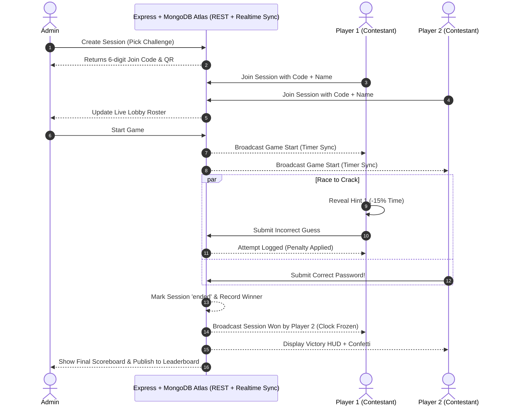

# ⚡ CrackVault

> **Multiplayer Cyber Password-Cracking Arena & Live Challenge Platform**

[](https://react.dev/)
[](https://www.typescriptlang.org/)
[](https://vitejs.dev/)
[](https://tailwindcss.com/)
[](https://expressjs.com/)
[](https://www.mongodb.com/atlas)
[](LICENSE)

---

## 📌 Table of Contents

- [Overview](#-overview)
- [Key Features](#-key-features)
  - [Player Arena](#-player-arena)
  - [Admin Command Center](#-admin-command-center)
  - [Scoring Algorithm](#-scoring-algorithm)
  - [Hint Penalty Curve](#-hint-penalty-curve)
- [Game Flow Architecture](#-game-flow-architecture)
- [Tech Stack](#-tech-stack)
- [Project Directory Structure](#-project-directory-structure)
- [Database Schema](#-database-schema)
- [Getting Started](#-getting-started)
  - [Prerequisites](#prerequisites)
  - [Installation](#installation)
  - [Environment Variables](#environment-variables)
  - [Database Setup & Migrations](#database-setup--migrations)
  - [Running Locally](#running-locally)
- [Security & Architecture Notes](#-security--architecture-notes)
- [License](#-license)

---

## 🌐 Overview

**CrackVault** is a real-time, competitive multiplayer password-cracking game designed for workshops, cybersecurity hackathons, classroom competitions, and team-building events. 

Administrators construct custom cyber puzzles equipped with secret passphrases, progressive clues, and multimedia hints. Contestants join instantly via a 6-character room code or QR code scan, competing head-to-head. The instant a contestant cracks the vault, real-time broadcasts lock out remaining players, freeze timers, and calculate global rankings.

---

## ✨ Key Features

### 🎮 Player Arena
- **Zero-Friction Entry:** Join instantly with a 6-character alphanumeric room PIN or by scanning a generated QR code. No user sign-up required.
- **Synchronized Multiplayer Lobby:** Real-time lobby reflecting joined contestants, waiting states, and game commencement synced via Express & MongoDB Atlas.
- **High-Stakes Vault Interface:** Cyber-themed terminal HUD displaying password attempt logs, remaining time, and instant validation feedback.
- **Strategic Escalating Clues (Text or Image):** Every hint (Hints 1 to 5 + Visual Clue) can be configured as **text** or **image**. When unlocked, image hints feature full-resolution Lightbox zoom inspection so contestants can examine visual details without restriction.
- **Urgency-Aware Timer:** Color-coded countdown timer (Green $\to$ Amber $\to$ Pulsing Crimson) ticking down in real time without unexpected clue penalty jumps.
- **Instant Victory Cascade:** When a player submits the correct password, the win event broadcasts across all connected sockets, freezing all player clocks and launching victory animations.

---

### 🛡️ Admin Command Center
- **Protected Administrator Login:** Secure credential gate (Customizable via Settings tab). Fields start clean without displaying or auto-filling credentials on the screen.
- **Clean Slate Default Architecture:** Starts with a 100% clean slate (0 pre-configured challenges, 0 active rooms, 0 dummy players), allowing event organizers to customize and deploy tailored puzzles directly.
- **Dynamic Visuals & Micro-Animations:** Ambient cyber particle matrix, floating glowing neon orbs, scanline sweep effects, interactive hover button beams, and smooth modal transitions.
- **Challenge Workshop with Image & Text Hints:**
  - Segmented toggle per hint: Choose **Text Clue** or **Image Clue** for every hint slot.
  - Dual Image Options: Paste an external image URL OR click **Upload Image** to attach local image files (PNG, JPG, WebP) directly from your device (stored as Base64 data URIs).
  - Live Thumbnail Preview: Instant visual preview within the creation modal with instant validation and remove controls.
  - Optional caption fields accompanying each visual clue.
- **Global Leaderboard:** Filterable historical leaderboard with 1st, 2nd, and 3rd place podium displays, score breakdowns, and time-to-solve records.
- **System Settings:** Update administrator credentials (username & password), configure session time limits, toggle synthesizer audio, and restore clean states.

---

### 🧮 Accuracy-Based Scoring Algorithm (Zero Time Penalty)

Scores reward solving the puzzle and submission accuracy. Score does **not** decay over time and hints are 100% free:

$$\text{Score} = \max\Big(0,\; 10000 - ((\text{Attempts} - 1) \times 50)\Big)$$

- **Base Vault Value:** Every cracked vault awards a base of **10,000 points**.
- **Accuracy Deduction:** Each incorrect guess after the first incurs a $-50$ point deduction.
- **Zero Time Penalty:** Score is **not** penalized by time. There is no time-based score decay for any player.
- **Zero Hint Penalty:** Timed progressive clue unlocks do not reduce points.

---

### ⏱️ Countdown-Based Hint Reveal System

Clues unlock **strictly based on the mission countdown clock** configured by the administrator:

- **Configurable Countdown Timing:** Administrators define a global release interval (e.g., 30s, 45s, 60s) or customize the exact elapsed seconds threshold for each individual clue (Hints 1 to 5 and the optional Visual Dossier).
- **Live Countdown Badges & Progress:** In the Player Arena, locked clues display a live countdown timer (`⏱️ UNLOCKS IN 00:24`) and dynamic charge progress bar.
- **Automatic Reveal:** When the mission clock reaches the configured target, the clue automatically unlocks with an audio alert—revealing text or full-res image with Lightbox zoom inspection.
- **Admin Force Reveal Override:** In the Mission Control panel, the administrator sees a live countdown to the next hint and can click `⚡ Reveal Next Clue Now` to broadcast an instant unlock to all connected contestants.

| Clue Slot | Format | Unlock Trigger | Score Deduction | Timer Impact |
|:---:|:---:|:---:|:---:|:---:|
| **Clue #1** | Text or Image | Configured Countdown (e.g. 30s) | **0 pts (Free)** | **0s** |
| **Clue #2** | Text or Image | Configured Countdown (e.g. 60s) | **0 pts (Free)** | **0s** |
| **Clue #3** | Text or Image | Configured Countdown (e.g. 120s) | **0 pts (Free)** | **0s** |
| **Clue #4** | Text or Image | Configured Countdown (e.g. 180s) | **0 pts (Free)** | **0s** |
| **Clue #5** | Text or Image | Configured Countdown (e.g. 240s) | **0 pts (Free)** | **0s** |
| **Visual Dossier** | Image (High-Res) | Configured Countdown (e.g. 260s) | **0 pts (Free)** | **0s** |

> ℹ️ *Hints reveal only after the countdown reached by the mission clock or when triggered by the admin broadcast. No contestant can spend points to reveal hints early.*

---

## 🔄 Game Flow Architecture



---

## 💻 Tech Stack

| Layer | Technology | Description |
|---|---|---|
| **UI Framework** | [React 18](https://react.dev/) | Component architecture with hooks & state management |
| **Language** | [TypeScript 5](https://www.typescriptlang.org/) | Type-safe development with strict contracts |
| **Build Tool** | [Vite 5](https://vitejs.dev/) | Lightning-fast HMR and optimized production bundling |
| **Styling** | [Tailwind CSS](https://tailwindcss.com/) | Dark cyber aesthetic, glowing neon accents, responsive layouts |
| **Icons** | [Lucide React](https://lucide.dev/) | Clean, consistent icons for UI states and actions |
| **Utilities** | [qrcode.react](https://www.npmjs.com/package/qrcode.react) | Client-side dynamic QR code generation for room codes |
| **FX** | [canvas-confetti](https://www.npmjs.com/package/canvas-confetti) | Visual particle celebration for triumphant vault solvers |
| **Backend Server** | [Express](https://expressjs.com/) | RESTful API routes with serverless deployment support |
| **Database** | [MongoDB Atlas](https://www.mongodb.com/atlas) | Cloud document database with Mongoose schemas |

---

## 📂 Project Directory Structure

```
crackvault/
├── index.html                   # HTML entry with custom fonts & meta tags
├── package.json                 # Project dependencies and scripts
├── tsconfig.json                # TypeScript root configuration
├── tsconfig.app.json            # Client TypeScript config
├── vite.config.ts               # Vite configuration plugins & paths
├── tailwind.config.js           # Cyberpunk color tokens & animations
│
├── server/                      # Express REST API & MongoDB Atlas backend
│   ├── index.js                 # Server entry point & DB connection
│   ├── models/                  # Mongoose data models (Challenge, Session, Player, Score, Settings)
│   └── routes/                  # API endpoints for CRUD & real-time polling sync
│
└── src/
    ├── main.tsx                 # React DOM mount point
    ├── App.tsx                  # Core router & navigation controller
    ├── index.css                # Custom CSS variables, glow utilities, keyframes
    │
    ├── lib/
    │   ├── api.ts               # Express + MongoDB Atlas REST API client
    │   └── storage.ts           # Hybrid local cache & polling sync engine
    │
    └── components/
        ├── Home.tsx             # Landing hero & quick-join portal
        ├── PlayerGame.tsx       # Player state machine (Join -> Lobby -> Race -> Victory/Defeat)
        ├── Leaderboard.tsx      # Public hall of fame & podium display
        ├── AdminDashboard.tsx   # Admin authentication gate & master layout
        ├── AdminSessions.tsx    # Live session launcher, QR modal & live scoreboard
        ├── AdminChallenges.tsx  # Challenge creation, hint manager & difficulty settings
        ├── AdminLeaderboard.tsx # Comprehensive admin score records & resets
        └── AdminSettings.tsx    # Security settings & admin credentials management
```

---

## 🗄️ Database Schema

The platform relies on 5 primary tables in PostgreSQL with Row Level Security (RLS) enabled:

```
┌─────────────────┐       ┌─────────────────┐       ┌─────────────────┐
│   challenges    │1     *│  game_sessions  │1     *│  game_players   │
├─────────────────┤───────├─────────────────┤───────├─────────────────┤
│ id (UUID, PK)   │       │ id (UUID, PK)   │       │ id (UUID, PK)   │
│ title           │       │ challenge_id(FK)│       │ session_id (FK) │
│ password        │       │ join_code       │       │ player_name     │
│ hint_1 .. hint_5│       │ status          │       │ status          │
│ image_url       │       │ started_at      │       │ attempts        │
│ time_limit      │       │ ended_at        │       │ hints_used      │
│ difficulty      │       └─────────────────┘       │ score           │
│ is_active       │                                 └─────────────────┘
└─────────────────┘
         │
         │1
         │*
┌─────────────────┐       ┌─────────────────┐
│     scores      │       │    settings     │
├─────────────────┤       ├─────────────────┤
│ id (UUID, PK)   │       │ key (Text, PK)  │
│ challenge_id(FK)│       │ value (Text)    │
│ player_name     │       │ updated_at      │
│ score           │       └─────────────────┘
│ time_taken      │
└─────────────────┘
```

---

## 🚀 Getting Started

### Prerequisites
- [Node.js](https://nodejs.org/) (version 18.0.0 or higher)
- [npm](https://www.npmjs.com/) or [pnpm](https://pnpm.io/)
- A free [MongoDB Atlas](https://www.mongodb.com/cloud/atlas) cluster (or local MongoDB)

---

### Installation

1. **Clone the repository:**
   ```bash
   git clone https://github.com/your-username/crackvault.git
   cd crackvault
   ```

2. **Install dependencies:**
   ```bash
   npm install
   ```

---

### Environment Variables

Create a `.env` file in the root directory:

```env
PORT=5000
MONGODB_URI=mongodb+srv://<username>:<password>@cluster0.18sjvym.mongodb.net/crackvault?retryWrites=true&w=majority
```

---

MongoDB Atlas collections (`challenges`, `sessions`, `players`, `scores`, `settings`) are created automatically on first connection.

---

### Running Locally

```bash
# Start Vite development server
npm run dev

# Run TypeScript typecheck
npm run build
```

The app will start at `http://localhost:5173`.

---

## 🔒 Security & Architecture Notes

- **Default Admin Login:** Username `admin` / Password `admin123`. Navigate to **Admin Command $\to$ Settings** to update these credentials, or click **Create Admin** right from the login screen to set custom credentials directly into MongoDB Atlas.
- **Client Verification & Anti-Cheat:** Password verification and game session orchestration are handled server-side via Express and MongoDB Atlas.

---

## 📄 License

Distributed under the MIT License. See `LICENSE` for details.
